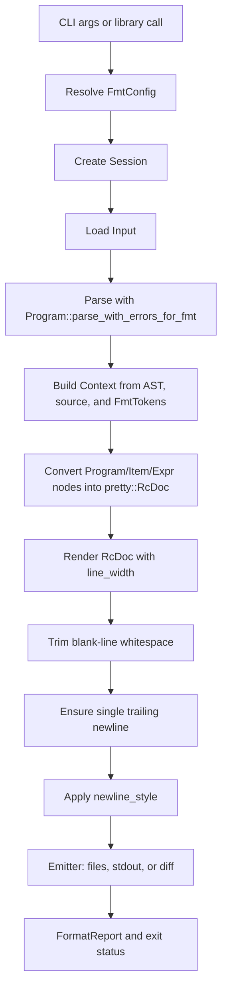

# Design of simfmt

`simfmt` formats SimplicityHL source code. The command line binary is named
`simfmt`; the formatting library crate is named `prettysimf`.

The project borrows some formatter vocabulary from rustfmt, but its actual
implementation is specific to SimplicityHL. It uses the SimplicityHL parser and
formatter token stream, builds a pretty-printing document, renders that document
with a width budget, and then emits the result to files, stdout, or a diff.

## Goals

The main goal is a dependable formatter for complete SimplicityHL files:

* parse SimplicityHL source with the same grammar used by the language project
* format valid source into a stable, readable style
* preserve comments and source trivia whenever the parser exposes enough span
  information to attach them safely
* preserve source details that are not represented in the AST, such as selected
  punctuation spans and type-level decimal literal spelling
* provide CLI workflows for in-place formatting, stdout formatting, CI checks,
  and config inspection
* provide a small in-memory library API for tools that want formatted text
  without touching the filesystem

Non-goals for the current design:

* formatting arbitrary snippets that do not parse as a complete program
* formatting invalid SimplicityHL source
* refactoring, renaming, or reordering user code
* guessing where unsupported comments belong when surrounding syntax lacks
  usable spans
* providing IDE-as-you-type incremental formatting

## Design Principles

### Preserve semantics

Formatting must not change the meaning of a program. The formatter may normalize
layout, whitespace, line breaks, separators, and other presentation details, but
it should not rename values, reorder declarations, rewrite expressions into a
different evaluation shape, or make edits that require semantic knowledge beyond
the parsed program.

### Prefer correctness over coverage

If the formatter cannot safely attach a comment or construct a document for a
valid program, it should report an error and leave file output unchanged rather
than silently dropping source text. This is especially important because
comments are carried outside the semantic AST in the formatter token stream.

### Use the parser for structure and tokens for lossless details

The AST gives the formatter reliable program structure. The formatter token
stream gives it source-backed details that the AST does not fully represent:
comments, whitespace trivia, semicolon positions, delimiter positions, comma
positions, and decimal literal spelling. `simfmt` is therefore a hybrid
formatter, not a pure AST formatter and not a token-only formatter.

### Keep formatting deterministic and idempotent

For any supported input, formatting the result again should produce the same
text. Unit tests and fixture tests should verify both the desired output and
idempotence as formatting support grows.

### Keep configuration small

The user-facing formatting configuration is deliberately narrow:

* `indent_width`
* `line_width`
* `newline_style`

Runtime output controls such as `emit_mode`, `color`, verbosity, and
`print_misformatted_file_names` belong to the CLI or session layer rather than
project formatting style.

## Crate Layout

```text
crates/cli
  src/bin/main.rs       process entry point and tracing setup
  src/cli.rs            argument parsing, operation selection, exit codes
  src/config.rs         simfmt.toml discovery and merge order

crates/prettysimf
  src/core.rs           public in-memory formatting API
  src/config.rs         resolved and partial formatter configuration
  src/fmt_processor     sessions, input loading, reports, formatted-file hook
  src/simplicity_fmt    SimplicityHL AST-to-document formatter
  src/emitter           files, stdout, and diff output backends
  src/newline_style.rs  newline detection and normalization
  src/reporter.rs       diagnostic rendering
```

## Formatting Pipeline



### Input

`prettysimf::utils::Input` represents either a real file path or stdin text.
`RawFormatContext::new` loads the text into memory and records the display name
used in reports. The current formatter works on one complete source file at a
time.

### Parsing

`RawFormatContext::format_lines` calls
`Program::parse_with_errors_for_fmt` from `simplicityhl`. The formatter enables
all unstable features for CLI formatting so it can handle the widest parser
surface available through the formatting parser.

If parsing produces diagnostics, they are converted into `FormattingError`
values with source snippets and stored in `FormatReport`. Formatting then stops
for that input, and the emitter is not asked to write a replacement.

### Document construction

`simplicity_fmt::fmt::format_program` creates a
`simplicity_fmt::core::Context` from:

* the resolved `InnerFmtConfig`
* the original source string
* parser-owned formatter tokens
* the parser prefix boundary

AST nodes implement the `Doc` trait in `simplicity_fmt::doc`. Each supported
node creates a `pretty::RcDoc`, and the final program document is rendered with
the configured `line_width`.

The `pretty` crate chooses line breaks from the document structure. Formatter
code should put semantic grouping decisions in the `RcDoc` tree and leave final
line fitting to the renderer.

### Trivia and comments

Comments are represented as lexer trivia, not ordinary AST nodes. The formatter
tracks them with `TriviaCursor`.

Callers consume trivia only for source ranges whose syntax ownership is known.
For example, the program formatter consumes the gap before the first item,
between items, and after the last item. More specific formatters consume gaps
around delimiters, statements, arms, parameters, and expressions.

After document construction, `format_program` checks
`context.trivia.remaining_comments()`. If any comment remains, formatting fails
with `ErrorKind::LostComment` instead of dropping the comment. This is the
project's main "do no harm" guard.

### Syntax cursors

Some formatting choices require punctuation that is not directly owned by AST
nodes. `SyntaxCursor` indexes spans for punctuation such as commas, semicolons,
braces, brackets, parentheses, arrows, and equals signs. Formatters use it to
attach comments around delimiters and to decide where source gaps begin and end.

Semicolon spans are also tracked in `Context` so statement formatting can move
past separators even when expression spans end before the semicolon.

### Literal preservation

The AST stores type-level constants as values, so the exact decimal spelling can
be lost. `Context` records decimal literal spans from formatter tokens and, when
formatting a type range, can recover the original spelling for matching values.
This preserves readable source choices such as underscores in type-level
numbers.

### Newlines

The document renderer emits canonical LF internally. After rendering,
`FormatContext::format_file`:

* removes whitespace from otherwise blank lines
* ensures exactly one trailing newline for non-empty formatted output
* applies the configured newline style

`newline_style = "auto"` preserves the first detected input line-ending style.
If the input contains no newline, it falls back to the platform-native style.

## Configuration

The CLI discovers project configuration from `simfmt.toml` or `.simfmt.toml`.
Discovery starts from the input path and walks upward. If no project config is
found, it also checks the user home directory and then the `simfmt` directory
under the user config directory, such as `~/.config/simfmt/`.

Configuration precedence is:

```text
defaults < config file < --config key=value
```

`FmtConfig` stores resolved values and tracks which options were explicitly set
or used during formatting. `PartialConfig` stores optional values read from TOML
or the command line. This lets `--print-config default`, `--print-config
current`, and `--print-config minimal` use the same configuration machinery.

## Emission

Emission is separated from formatting through the `Emitter` trait:

* `FilesEmitter` overwrites real files when formatted text differs
* `StdoutEmitter` writes formatted text to stdout
* `DiffEmitter` compares original and formatted text and prints a diff for
  `--check`

The session owns the selected emitter and calls it only after an input has
parsed and formatted successfully. Errors and diffs are reflected in the
session's report flags so the CLI can return a non-zero exit code when needed.

## Public Library API

`prettysimf::pretty_simf_please` formats source held in memory:

```rust
use prettysimf::{FmtFriendlyConfig, pretty_simf_please};

let formatted = pretty_simf_please(source, FmtFriendlyConfig::default())?;
```

`FmtFriendlyConfig` exposes only stable formatting concerns:
`indent_width`, `line_width`, and `newline_style`. Internally it maps to
`FmtConfig` with quiet stdout emission and no colors, then returns the formatted
string from an in-memory output buffer.

## Error Model

The formatter distinguishes:

* operational errors, such as file I/O failures
* parser diagnostics from SimplicityHL
* formatter construction or rendering failures
* unsupported comments that could not be safely attached
* check-mode diffs

User-facing diagnostics are rendered through `annotate-snippets` so parse errors
and lost comments can point at source spans.

## Testing Strategy

The test suite has two complementary layers:

* unit tests in `prettysimf` for config behavior, newline handling, trivia
  ownership, document construction, comment preservation, and idempotence
* CLI fixture tests under `crates/cli/tests/source` and
  `crates/cli/tests/target` for real contracts and representative formatting
  cases

New syntax support should usually add both focused formatter tests and at least
one fixture when it affects user-visible output.

## Extending Formatting Support

When adding support for a new SimplicityHL construct:

1. Prefer using spans exposed by the SimplicityHL parser.
2. Add `Doc` implementations or helpers close to neighboring syntax.
3. Consume trivia only for source ranges whose ownership is clear.
4. Use `SyntaxCursor` when delimiter or separator spans are needed.
5. Preserve source-backed details when the AST intentionally normalizes them.
6. Return `None` or a precise formatter error instead of guessing.
7. Add idempotence coverage and, when comments are involved, tests that prove no
   comment is lost.

The formatter should grow construct by construct while keeping already-supported
code stable.
